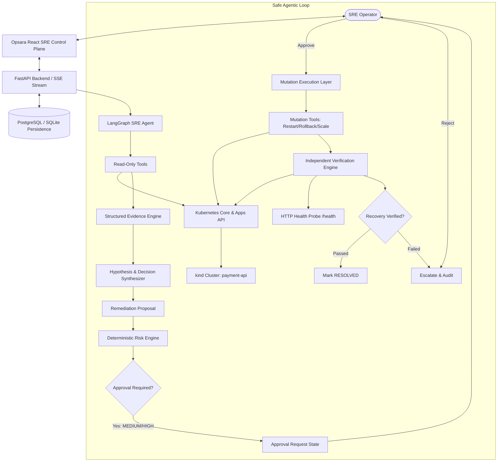

# Opsara — Agentic Kubernetes Incident Response Platform

> **Investigate. Approve. Remediate. Verify.**

Opsara is an agentic SRE and incident response platform built for the **TrueFoundry "Agents That Act" Hackathon** (Runbook Executor theme).

Opsara gives an autonomous agent the ability to inspect live Kubernetes clusters, interpret operational runbooks, synthesize evidence-backed diagnoses, propose safe remediations, pause for mandatory human approval before mutating infrastructure, execute approved actions, and independently verify recovery.

---

## 🎯 The Core Problem

During production incidents, engineers frequently execute repetitive operational runbooks under pressure. However, **identical symptoms can have completely distinct root causes**:

- **Scenario A**: Pod crash due to memory limit exhaustion (`OOMKilled`) → A rolling restart can safely clear memory leaks and recycle the workload.
- **Scenario B**: Pod crash or errors due to database connection refusal (`connection refused`) → Restarting the application pod will **never** fix the unreachable database, and risks stampeding the database on restart.
- **Scenario C**: Deployment rollout failure due to invalid configuration or bad container image → Rollback to the previous healthy revision is required.

Opsara replaces blind automated scripts with an **evidence-based agentic control plane** that knows what to investigate, what to propose, and crucially, **when NOT to act**.

---

## 🏗️ Architecture



---

## 🛡️ Safety Model: Deterministic Risk & Human-in-the-Loop

1. **Zero Uncontrolled Mutations**:
   Read-only tools (`inspect_pods`, `get_pod_logs`, `get_kubernetes_events`, `inspect_deployment`, `run_health_check`) execute autonomously during investigation. Mutating tools (`restart_deployment`, `rollback_deployment`, `scale_deployment`) **never** execute directly from an LLM tool call.

2. **Deterministic Risk Engine**:
   Safety is evaluated server-side in Python, not hallucinated by the LLM:
   - `READ_ONLY`: Autonomous execution.
   - `LOW / MEDIUM`: Rolling restart of unhealthy workloads → Operator approval required.
   - `HIGH`: Rollback to previous revision or scale down → Operator approval required.
   - `CRITICAL`: Destructive actions or scale to 0 → Strict operator lock.

3. **Multi-Point Deterministic Verification**:
   Recovery is never proclaimed by LLM prompt text. The backend independently verifies:
   - Desired vs available and ready replicas.
   - Pod readiness status and absence of CrashLoopBackOff.
   - HTTP health probe returns `200 OK` with sub-100ms latency.
   - Clean cluster warning event stream.

---

## 🚀 Quickstart Guide

### Prerequisites
- Python 3.12+
- Node.js 18+ and npm
- Docker Desktop & kind (or Minikube / any accessible Kubernetes cluster)

### 1. Environment Setup
```bash
git clone <repo>
cd opsara

# Copy environment template
cp .env.example .env
```

### 2. Backend Setup
```bash
cd backend
pip install -r requirements.txt

# Run test suite (All tests should pass)
pytest -v

# Start FastAPI backend
python -m uvicorn app.main:app --host 127.0.0.1 --port 8000 --reload
```

### 3. Frontend Setup
```bash
cd ../frontend
npm install
npm run dev
```
Open **http://localhost:3000** in your browser to access the Opsara SRE Control Plane.

---

## 🧪 Demonstrations & Scenarios

Use the built-in scenario triggers directly from the Opsara top header:

1. **OOM Recovery Demo**:
   Click `Simulate: OOM Crash`. Creates container memory exhaustion. Agent inspects pods, discovers `OOMKilled`, gathers evidence, proposes rolling restart (`MEDIUM RISK`), halts for operator approval, executes upon authorization, and verifies full recovery.
2. **Database Failure Demo (Intelligent Refusal)**:
   Click `Simulate: DB Failure`. Agent detects database connection refused in logs and health probe. Refuses to restart the application blindly; marks `ESCALATED` to DBA team.
3. **Failed Rollout Demo**:
   Click `Simulate: Failed Rollout`. Agent identifies stalled rollout, proposes rollback (`HIGH RISK`), executes rollback upon approval, and verifies recovery.

---

## 📁 Repository Structure

```text
opsara/
├── backend/
│   ├── app/
│   │   ├── api/          # FastAPI routers (incidents, approvals, cluster, runbooks, audit, scenarios)
│   │   ├── agents/       # LangGraph SRE agent state, nodes, graph, and prompts
│   │   ├── kubernetes/   # Real Kubernetes read client and mutation client
│   │   ├── risk/         # Deterministic risk engine and classification rules
│   │   ├── verification/ # Multi-point deterministic recovery verification engine
│   │   ├── database/     # Async SQLAlchemy models, migrations, and repositories
│   │   └── runbooks/     # Operational runbook catalog & parser
│   └── tests/            # Pytest test suite for risk engine, agent, and k8s inspection
├── frontend/             # Dark-first React + Vite + TypeScript SRE Control Plane
├── k8s/                  # Kubernetes manifests (opsara-demo namespace, payment-api, runbooks)
└── docs/                 # Architecture, safety model, and demo documentation
```

---

## ⚖️ License
Apache-2.0 License.
