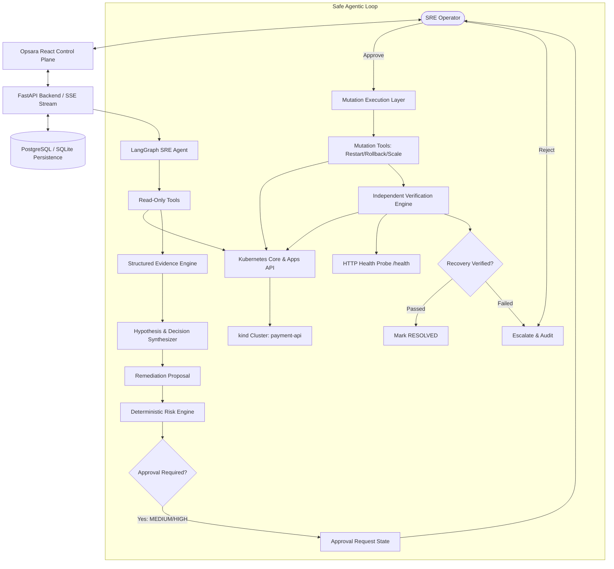

# Opsara Architecture Specification

Opsara is an agentic SRE control plane that orchestrates Kubernetes incident response through a controlled loop:
**Investigate → Reason → Propose → Approve → Act → Verify**.

## Core System Architecture

## Layer Separation & Invariants

1. **Strict Mutation Boundary**:
   - The LLM agent has ZERO direct write or mutate permissions.
   - Read-only tools (`inspect_pods`, `get_pod_logs`, `get_kubernetes_events`, `inspect_deployment`, `run_health_check`) execute autonomously during the investigation phase.
   - Any mutating operation (`restart_deployment`, `rollback_deployment`, `scale_deployment`) MUST produce an explicit `Proposal` and transition the incident into `WAITING_FOR_APPROVAL`.

2. **Deterministic Risk Engine**:
   - Infrastructure safety is never delegated to LLM confidence.
   - The server-side Python risk engine evaluates:
     - Target action type
     - Current ready vs desired replicas
     - Namespace criticality
     - Rollback availability
   - Mutations on active workloads are strictly marked `MEDIUM` or `HIGH` risk, mandating operator review.

3. **Deterministic Verification Engine**:
   - Recovery is never assumed.
   - After remediation, the system independently verifies:
     - `available_replicas == desired_replicas`
     - All pods in `Running` phase and `ready == True`
     - Absence of active `CrashLoopBackOff` or `OOMKilled` terminations
     - Live HTTP `/health` probe returns `HTTP 200` with passing internal checks.
